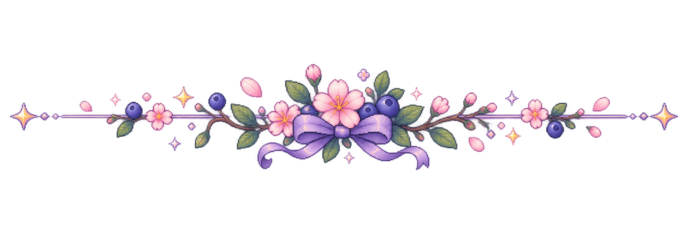
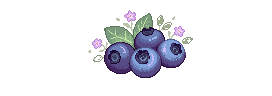

<!-- ═══════════════════════════════════════════════════════ -->
<!--                         BANNER                           -->
<!-- ═══════════════════════════════════════════════════════ -->

  

  <i>
    Building things, learning things, and occasionally breaking things. 🖥️
  </i>

 

<!-- ═══════════════════════════════════════════════════════ -->
<!--                    ABOUT ME / TECH                      -->
<!-- ═══════════════════════════════════════════════════════ -->

<table width="100%">
<tr>

<td width="50%" valign="top">

## 🌸 ABOUT ME

<table width="90%">
<tr>
<td
align="center"
valign="middle"
bgcolor="#F0E2F2"
height="190"
>

 

🌸 🪻 🫐 🌷 🫐 🪻 🌸

  

<b>A little corner about me</b>

 

<i>Illustration coming soon ♡</i>

  

🌷 🫐 🌸 🪻 🌸 🫐 🌷

 

</td>
</tr>
</table>

 

I'm a **Computer Science student** with a passion for software development.

I enjoy building useful and creative applications, from backend logic and problem solving to interactive user experiences.

I'm currently exploring both **software development** and **full-stack technologies**, while building personal projects to turn what I learn into something tangible.

I believe the best way to learn is to **build, experiment, and sometimes break things along the way.** 🌱

</td>

<td width="50%" valign="top">

## 🌸 TECHNOLOGIES

### LANGUAGES

 

| | Technology |
|---|---|
| 🔵 | **C** |
| 🟣 | **C++** |
| ☕ | **Java** |
| 🐍 | **Python** |
| 🗄️ | **SQL** |
| 🔷 | **TypeScript** |

 

### 🌱 EXPLORING

 

</td>

</tr>
</table>

 

<!-- ═══════════════════════════════════════════════════════ -->
<!--                   CURRENTLY BUILDING                    -->
<!-- ═══════════════════════════════════════════════════════ -->

# 🌷 CURRENTLY BUILDING

<table width="100%">
<tr>

<td width="50%" valign="top">

<table width="90%">
<tr>
<td
align="center"
valign="middle"
bgcolor="#F4E5EF"
height="150"
>

 

🗂️ 🌸 🪻 🌷

  

<b>Task Manager</b>

 

<i>Project preview coming soon ♡</i>

  

🌷 🫐 🌸

 

</td>
</tr>
</table>

 

### 🗂️ Task Manager

A task management application built with **Java**, **Spring Boot**, created to practice object-oriented programming and software design.

 

**FOCUS**

`Java` `OOP` `Software Design` `Spring Boot`

  

🌱 *Repository coming soon...*

</td>

<td width="50%" valign="top">

<table width="90%">
<tr>
<td
align="center"
valign="middle"
bgcolor="#E9E0F3"
height="150"
>

 

🏡 🌸 🫐 🪻

  

<b>Pixel Portfolio</b>

 

<i>Project preview coming soon ♡</i>

  

🪻 🌷 🫐

 

</td>
</tr>
</table>

 

### 🏡 Pixel Portfolio

An interactive virtual room in pixel art, built with **TypeScript**, designed to become my personal portfolio and a creative way to showcase my projects.

 

**FOCUS**

`TypeScript` `Interactive UI` `Pixel Art` `Web Development`

  

🌱 *Repository coming soon...*

 

🌐 *Live demo coming soon...*

</td>

</tr>
</table>

 

<!-- ═══════════════════════════════════════════════════════ -->
<!--                    CURRENTLY LEARNING                   -->
<!-- ═══════════════════════════════════════════════════════ -->

<table width="100%">
<tr>

<td width="50%" valign="top">

## 🌱 CURRENTLY LEARNING

🌸 Improving my **Java** and object-oriented programming skills.

  

🌐 Exploring **TypeScript** and modern web development.

</td>

<td width="50%" valign="top">

🧩 Learning how to design and structure larger applications.

  

💡 Turning ideas into complete personal projects.

  

🌱 Learning through practice, experimentation and curiosity.

</td>

</tr>
</table>

 

<!-- ═══════════════════════════════════════════════════════ -->
<!--                      GITHUB STATS                       -->
<!-- ═══════════════════════════════════════════════════════ -->

<!--
# 🌙 GITHUB STATS

<table>
<tr>

<td width="50%" align="center" valign="middle">

</td>

<td width="50%" align="center" valign="middle">

  

</td>

</tr>
</table>

 

<i>✨ Stats will grow as more contributions are made! ✨</i>

 

-->

<!-- ═══════════════════════════════════════════════════════ -->
<!--                       LET'S CONNECT                     -->
<!-- ═══════════════════════════════════════════════════════ -->

# 🌸 LET'S CONNECT

Feel free to explore my repositories and follow my journey 
as I learn, build, experiment and grow as a developer. 🌷

  

<!-- ADD YOUR EMAIL -->

 

 

🌸
<i>
Learning, building, experimenting, 
and growing one project at a time.
</i>
🌸

 

 

Made with curiosity, code & a little bit of magic ✨

